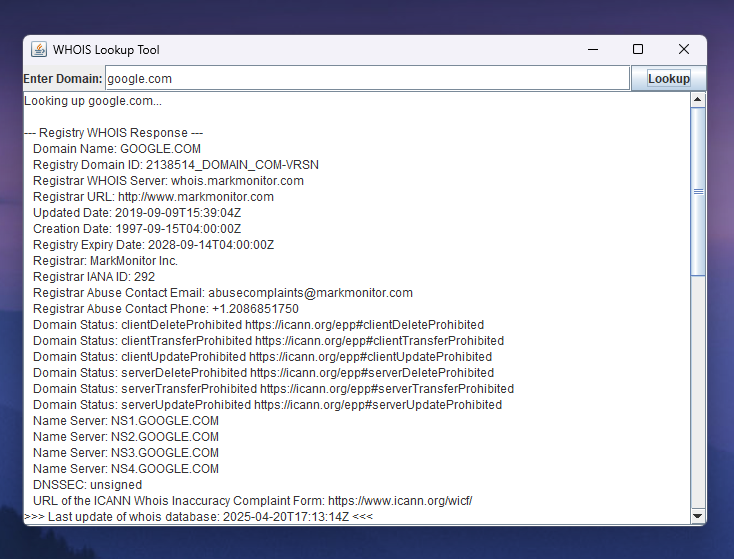

# 
 WhoIs Lookup Tool 

A simple yet powerful WhoIs domain lookup tool built in Java using Swing GUI. This tool lets users query WhoIs information for any domain, including registrar-level WhoIs details when available.

## 📸 Screenshot

        

## 🛠️ Usage:

1. Install [JDK](https://www.oracle.com/java/technologies/downloads/) if you haven't already.

2. Download [WhoisGUI.java](WhoisGUI.java) and run it.

## 💻 Technologies Used

- Java
- Java Swing (GUI)
- Socket Programming (Port 43 WHOIS queries)

## Created by:

- [Christin Raju](https://github.com/ChristinRaju)
- [Alan Benny](https://github.com/AlanBennyOfficial)
